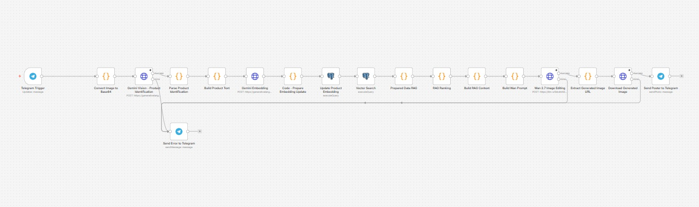
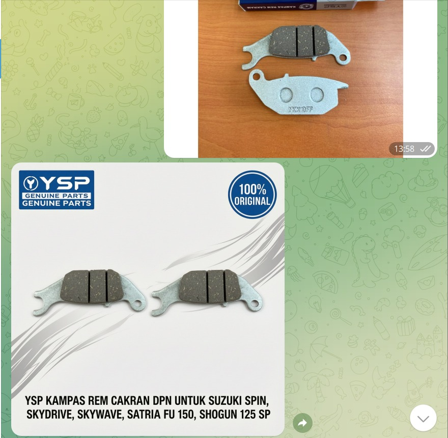

# 🛵 AI Automation Product Poster Edit Generator

Automasi pembuatan poster produk *e-commerce* suku cadang motor secara otomatis menggunakan **n8n**, **Gemini Vision**, **Postgresql Vector Search (RAG)**, dan **Qwen3**.

Cukup kirimkan foto *spare part* via **Telegram**, dan bot akan memproses identifikasi produk, mencocokkan ke database katalog, serta menghasilkan poster siap pakai (*1:1 square aspect ratio*) lengkap dengan teks overlay dan elemen branding profesional.

---

## 🖼️ Workflow Architecture



## 🖼️ Testimoni


---

## 🚀 Alur Kerja (End-to-End Flow)

```text
[Telegram User] 
       │ (Kirim Foto Spare Part)
       ▼
[Telegram Trigger] ──► [Convert Base64] ──► [Gemini Vision 1.5 Flash]
                                                    │ (Extract Metadata JSON)
                                                    ▼
[RAG Context Builder] ◄── [Vector Search / RAG] ◄── [Parse Identification]
       │
       ▼
[Build Wan Prompt] ──► [Wan 2.7 AI Generation] ──► [Download Poster] ──► [Telegram Send Photo]
